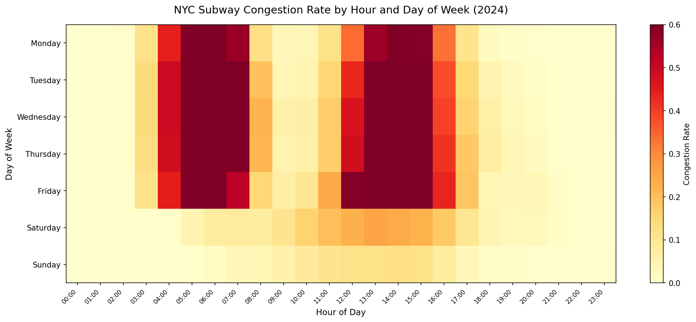
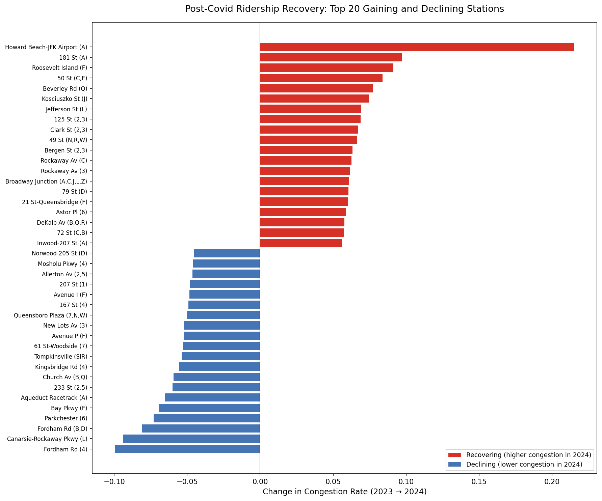
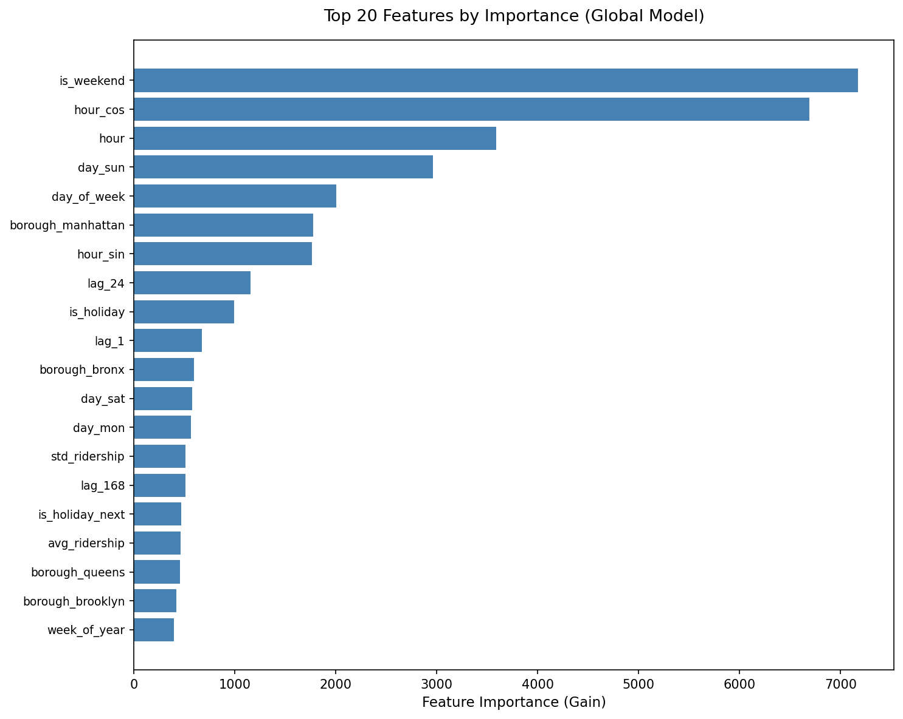
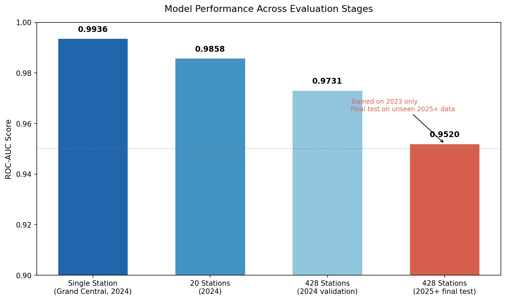
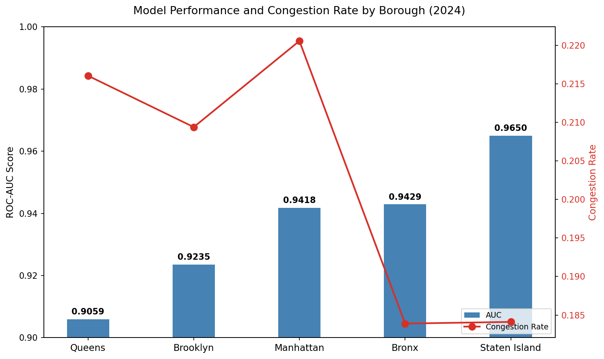
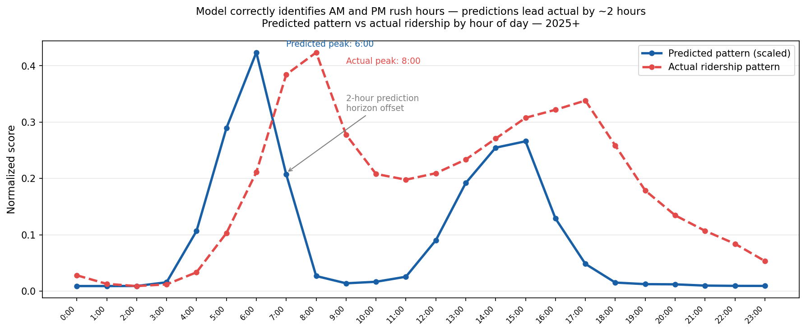

# MTA Subway Congestion Forecasting

A machine learning pipeline that predicts NYC subway station congestion 2 hours in advance across all 428 stations in the system. Trained on 2023 post-Covid ridership data, validated on 2024, and evaluated on genuinely unseen 2025-2026 data.

**Final result: AUC 0.9520 on 3.2M rows of unseen future data across 428 stations.**

---

## Live Tools

- **[Station Busyness Planner](https://zhou-ray.github.io/mta-congestion/visualizations/forecast.html)** — 90-day busyness forecast for any of 428 stations. Updated weekly via GitHub Actions.
- **[Interactive Congestion Map](https://zhou-ray.github.io/mta-congestion/visualizations/map.html)** — all 428 stations colored by congestion rate, drift, or model AUC. Filter by borough, tier, or train line.
- **[Congestion Animation](https://zhou-ray.github.io/mta-congestion/visualizations/animation.html)** — hourly ridership animated across the system for a typical weekday or a specific week.

---

## Visualizations














---

## Problem

NYC subway congestion is difficult to anticipate. Commuters have no reliable way to know whether a station will be overcrowded 2 hours from now. This project builds a binary classifier that predicts whether a given station will exceed its historical 80th percentile ridership threshold 2 hours ahead, using only information available at prediction time.

---

## Data

- **Source:** MTA Subway Hourly Ridership via NYC Open Data (SODA API)
- **Historical dataset:** 2020-2024, ~120M rows
- **Current dataset:** 2025+, updated incrementally
- **Coverage:** 428 station complexes across all 5 NYC boroughs
- **Granularity:** Hourly turnstile entries per station per payment method

---

## Architecture

```
SODA API
   ↓
Incremental Ingestion (watermark-based)
   ↓
Partitioned Parquet Storage (year/month)
   ↓
DuckDB Query Layer
   ↓
Feature Engineering
   ↓
XGBoost Global Model
   ↓
Evaluation + Forecast Tool
```

**Storage:** Hive-partitioned Parquet files enable DuckDB partition pruning — queries only scan relevant files rather than the full dataset. The watermark system reduces incremental update data transfer by ~70% by only fetching records newer than the last ingested timestamp.

**Processing:** Month-by-month pipeline bounds memory usage for the full 120M row dataset on standard hardware.

---

## Features

**Time features (17)**
Hour, day of week, month, week of year, weekend flag, shoulder day flag (Mon/Fri), one-hot day encoding, cyclical sin/cos encoding for hour and month. Cyclical encoding ensures the model understands hour 23 and hour 0 are adjacent rather than 23 units apart.

**Lag features (6)**
Per-station lag at 1 hour, 24 hours (same hour yesterday), and 168 hours (same hour last week). Rolling 24h and 168h mean and standard deviation. All computed with groupby(station) to prevent cross-station data leakage. Rolling windows use shift(1) to ensure only past values are included.

**Holiday features (6)**
Federal holidays, holiday eve, day after holiday, NYC Marathon (first Sunday of November), Thanksgiving Eve, pre-Thanksgiving Saturday. NYC-specific events added beyond the federal calendar to capture local transit patterns.

**Station features (11)**
Number of lines serving the station (extracted from station name), terminal flag, average ridership, standard deviation, max ridership, station tier (quartile-based), borough one-hot encoding. These give the global model a fingerprint of each station without one-hot encoding 428 station names.

---

## Target Variable

Binary classification: `is_congested = 1` if ridership 2 hours ahead exceeds the station's 80th percentile threshold.

- **Per-station threshold** normalizes for scale differences across stations
- **Threshold computed on training data only** to prevent label leakage
- **Horizon = 2 hours** — tested horizon=1 (marginal improvement) but chose horizon=2 for practical usefulness

---

## Model

**Algorithm:** XGBoost binary classifier

**Why XGBoost:** Gradient boosted trees consistently outperform linear models on tabular data, handle mixed feature types natively, provide feature importance, and are industry standard for this problem type.

**Configuration:**
- n_estimators: 500
- learning_rate: 0.05
- max_depth: 6
- subsample: 0.8
- colsample_bytree: 0.8
- scale_pos_weight: auto (handles 80/20 class imbalance)
- early_stopping_rounds: 20

**Hyperparameter tuning:** Reducing learning rate to 0.02 with 1000 trees underperformed the baseline (AUC 0.9710 vs 0.9731). The performance ceiling is driven by genuine behavioral drift between training and test years rather than insufficient model capacity.

---

## Training Strategy

**Train: 2023 only**
**Validate: 2024**
**Final test: 2025+ (genuinely unseen)**

The full 2020-2024 dataset was not used for training. Drift analysis revealed a structural break between Covid-era (2020-2022) and post-Covid (2023+) ridership patterns. Major hub stations show 18-24% higher congestion rates in 2024 versus 2020-2023 averages. Training on Covid-era data would introduce noise irrelevant to forecasting current behavior. 2023 represents the stabilized post-Covid new normal.

---

## Results

| Evaluation | AUC | Precision | Recall | Rows |
|---|---|---|---|---|
| Single station, 2024 (Grand Central) | 0.9936 | 0.97 | 0.94 | 1,575 |
| 20 stations, 2024 | 0.9858 | 0.84 | 0.92 | 134,897 |
| 428 stations, 2024 (validation) | 0.9731 | 0.71 | 0.92 | 2,819,747 |
| 428 stations, 2025+ (final test) | 0.9520 | 0.70 | 0.88 | 3,257,138 |

The gradual performance degradation as scale increases and time horizon extends is expected and honest. A model that held perfectly flat would be suspicious.

**Post-Covid drift:** Congestion rate increased from 20.1% in training (2023) to 21.0% in validation (2024) to 22.7% in final test (2025+), consistent with continued post-Covid ridership recovery.

**Borough breakdown:** AUC ranges from Queens (lowest) to Manhattan (highest). Queens performance is dragged down by high-variance stations like Howard Beach-JFK Airport (+21% drift) whose ridership is tied to air travel recovery patterns.

**Monthly AUC on 2025+ data:** Mean AUC of 0.91 across 14 months, never dropping below 0.90 despite being evaluated more than 2 years after the training period.

**Calibration:** Well calibrated at high probabilities. Slightly overestimates certainty at low probabilities due to post-Covid threshold drift — when the model predicts low congestion probability, actual congestion still occurs ~13% of the time because 2025 ridership exceeds 2023 baselines.

**Prediction horizon finding:** Predicted congestion peaks occur approximately 2 hours before actual ridership peaks — consistent with the 2-hour prediction horizon. The model correctly identifies rush hour structure but predicts it in advance as designed.

---

## Failure Analysis

All high-confidence false negatives have identifiable external causes:

- **Holiday events** — Federal holidays and NYC-specific events (NYC Marathon, Thanksgiving Eve) break regular weekly patterns. Holiday features were added after identifying these failures, improving precision from 0.93 to 0.96.
- **Unknown events** — Concerts, large gatherings, and other one-off events cannot be predicted without external event data. Documented as a known limitation.
- **Horizon sensitivity** — False negatives cluster around midday hours preceding sharp afternoon peaks. At horizon=2, current ridership at noon provides insufficient signal that a spike will occur at 2pm. This is a fundamental tradeoff, not a fixable bug.

---

## Station Busyness Planner

The [forecast tool](https://zhou-ray.github.io/mta-congestion/visualizations/forecast.html) provides a 90-day busyness forecast for any station. Search for your station, select a travel time, and see predicted busyness for the next 14 days with a full 24-hour hourly breakdown.

**Note:** Busyness is relative to each station's historical volume, not absolute crowding. A station showing "busier than usual" at 8am may have fewer total riders than a quieter major hub — the forecast reflects how busy the station is compared to its own typical pattern.

**Line filter note:** The line filter shows stations served by a selected train line, but ridership figures represent total station entries across all lines. The MTA dataset captures turnstile entries per station, not per train, so per-line ridership breakdown is not possible with this data source.

The forecast is regenerated weekly via GitHub Actions using the trained model and precomputed historical averages as lag feature proxies.

---

## Setup

### System dependencies

```bash
# Mac only
brew install libomp
```

### Python environment

```bash
git clone https://github.com/zhou-ray/mta-congestion.git
cd mta-congestion
python3 -m venv .venv
source .venv/bin/activate
pip install -r requirements.txt
```

### Environment variables

```bash
cp .env.example .env
# Add your Socrata API token — get one free at data.ny.gov
```

---

## Running the Pipeline

### Backfill historical data (2023-2024)

```bash
PYTHONPATH=. python scripts/backfill.py
```

### Ingest 2025+ data

```bash
PYTHONPATH=. python scripts/ingest_2025.py
```

### Train the model

```bash
PYTHONPATH=. python scripts/train.py
```

### Evaluate on 2025+ data

```bash
PYTHONPATH=. python scripts/evaluate_2025.py
```

### Generate visualizations

```bash
PYTHONPATH=. python scripts/visualizations.py
PYTHONPATH=. python scripts/generate_map.py
PYTHONPATH=. python scripts/generate_animation.py
```

### Generate forecast tool

```bash
PYTHONPATH=. python scripts/forecast.py
PYTHONPATH=. python scripts/generate_forecast_tool.py
```

---

## Data Notes

**Line filter:** The line filter in the interactive tools shows stations served by a selected train line, but ridership figures represent total station entries — not ridership attributed to that specific line. The MTA hourly ridership dataset captures station entries, not individual train boardings.

**Station name changes:** The 2025+ dataset uses updated station naming conventions for some stations (dash separators instead of slash, reordered line letters). The pipeline normalizes these differences for consistent model predictions.

---

## Known Limitations

- **Rare events** — Events occurring 1-2 times per year provide insufficient training signal. External event data would address this.
- **Ridership trend drift** — The model is trained on 2023 baselines. As ridership continues to grow, periodic retraining is recommended.
- **No real-time inference** — The pipeline is batch-oriented. Real-time prediction would require a serving layer and streaming feature computation.
- **Station entries not train boardings** — The dataset captures turnstile entries per station, not per train. Multi-line stations aggregate ridership across all lines.
- **Forecast uses historical averages as lag proxies** — Future predictions use 2023 average ridership patterns as stand-ins for actual future lag values. This is accurate for regular patterns but less reliable for anomalous periods.

---

## Project Structure

```
mta-congestion/
├── scripts/
│   ├── backfill.py              # Historical data ingestion (2023-2024)
│   ├── ingest_2025.py           # Incremental 2025+ ingestion
│   ├── train.py                 # Model training pipeline
│   ├── evaluate_2025.py         # Final evaluation on unseen data
│   ├── forecast.py              # Precompute 90-day station forecasts
│   ├── visualizations.py        # Static charts and data exports
│   ├── generate_map.py          # Interactive station map
│   ├── generate_animation.py    # Congestion animation
│   └── generate_forecast_tool.py # Station busyness planner
├── src/
│   ├── config.py                # Environment and path configuration
│   ├── fetcher.py               # SODA API pagination and cleaning
│   ├── writer.py                # Parquet writing and watermark management
│   ├── query.py                 # DuckDB query layer
│   ├── features.py              # Feature engineering
│   ├── station_features.py      # Static station-level features
│   └── model.py                 # XGBoost training and evaluation
├── notebooks/
│   └── exploration.ipynb
├── data/
│   ├── raw/                     # Partitioned Parquet files (gitignored)
│   ├── cache/                   # Watermark (gitignored)
│   ├── models/                  # Saved model and thresholds
│   ├── lag_lookup.json          # Precomputed lag averages for forecast
│   └── station_features.json    # Precomputed station features for forecast
├── visualizations/              # Generated charts and interactive tools
├── .github/
│   └── workflows/
│       └── update_forecast.yml  # Weekly forecast regeneration
├── requirements.txt
└── .env.example
```

---

## Decision Log

A full record of architectural and modeling decisions with reasoning was maintained throughout the project. Key decisions include the post-Covid training cutoff, per-station threshold computation, horizon selection, global vs per-station model architecture, hyperparameter tuning findings, and the station naming normalization approach for 2025+ data.

---

*Data source: MTA Subway Hourly Ridership, NYC Open Data. Model trained on 2023 data. Forecast updated weekly. Evaluated through February 2026.*
